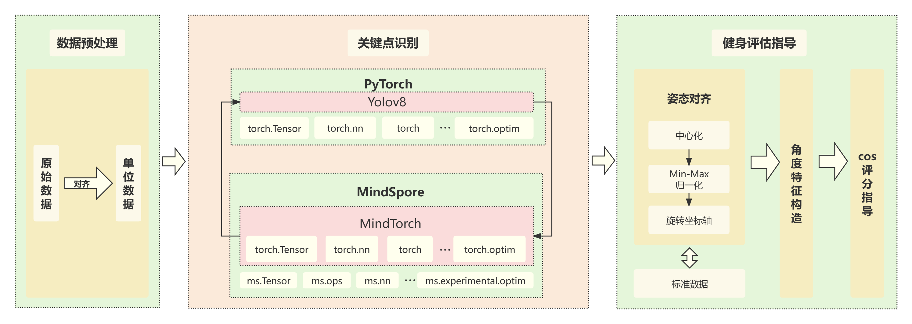

# 健身动作评估指导

本项目旨在对健身动作进行评估指导，将健身视频(mp4文件)输入，即可得到对应评分和指导，结果以打印和输出视频(mp4)进行可视化展示，下图为本项目技术总览图。



目前仅支持三种健身动作： **猫式伸展** 、 **死式虫** 和 **静态臀桥** 的健身动作 **评估** ，后续将持续更新更多健身动作和健身动作 **指导** 。以下为 **demo.py(action_type=2)** 对 **死虫式** 的评估展示。


## 调试任务选项

1. 镜像选择: `mindtorch0.3_mindspore2.3.0_torchnpu2.2.0_cann8.0` (以下安装基于此环境)
2. 数据集: `Fitness_video` of `CarlCypress/fitness_evaluation`
3. 模型: `ActionRecognition_model_knvi` of `CarlCypress/fitness_evaluation`

## 安装

```shell
git clone https://openi.pcl.ac.cn/CarlCypress/fitness_evaluation.git
cd fitness_evaluation
python setup.py
```

## 执行

```shell
python demo.py
```

> `demo.py` 文件中，`action_type` 为运动类型：`1 = 猫式伸展, 2 = 死式虫, 3 = 静态臀桥` 
>
> 可视化视频结果保存在 `./result/evaluation.mp4`

## 其他

该项目源自MindSpore竞赛，原仓库地址为：https://openi.pcl.ac.cn/CarlCypress/fitness_evaluation，以下为相关荣誉。


